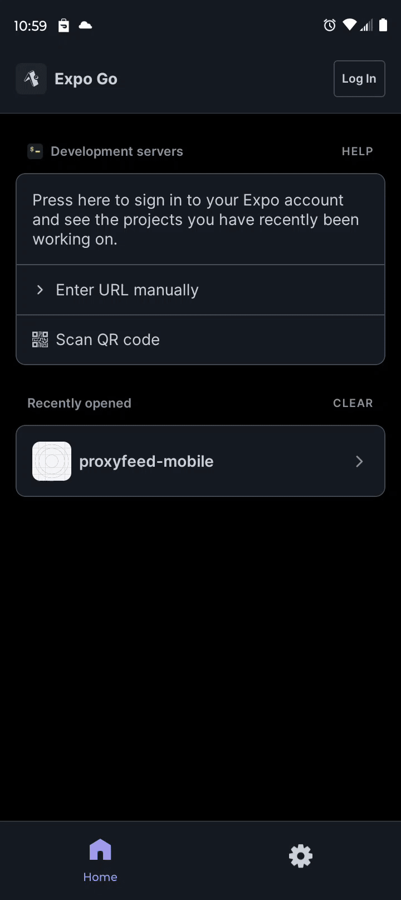

# ProxyFeed Mobile (MVP)

A minimal React Native (Expo) client for **ProxyFeed**. Log in with your account (cookie-based session), list your feeds via `/api/feeds`, and trigger “Fetch now” for any feed. Built to demonstrate quick RN onboarding and integration with an existing backend. No over‑engineering, just a focused MVP you can run and show.

## Features

- Cookie session login against `https://proxyfeed.io`
- Feed list via `GET /api/feeds`
- Fetch now action via `POST /refetch/:feedId`
- Autologin on app start
- Open public feed URL in browser
- Works in Expo (managed)

## Stack

- React Native (Expo, TypeScript)
- axios with cookie sessions
- React Navigation

## API Endpoints

- `POST /auth/login` – sets session cookie
- `GET /api/feeds` – returns feed list
- `POST /refetch/:feedId` – triggers feed refresh

## Requirements

- Node.js LTS
- Expo CLI
- ProxyFeed backend at `https://proxyfeed.io`

## Setup

```bash
git clone https://github.com/proxyfeed/proxyfeed-mobile.git
cd proxyfeed-mobile
npm install
cp .env.example .env
npx expo start
```

## Demo

